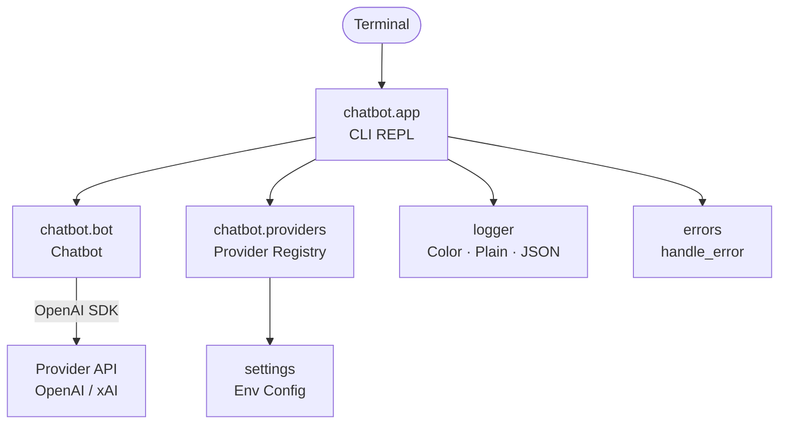

# OpenAI ChatBot


A multi-provider CLI chatbot built on OpenAI-compatible Chat Completions APIs. Switch between providers with a single environment variable.

## Overview

OpenAI ChatBot is an interactive terminal application that lets you converse with large language models from multiple providers through a unified interface. It uses the official [OpenAI Python SDK](https://github.com/openai/openai-python) under the hood, which means any provider offering an OpenAI-compatible API can be plugged in with zero code changes.

The project follows a **uv workspace monorepo** layout with shared packages for logging, configuration, and error handling -- the same structure used across production Python projects.

### Supported Providers

| Provider | Default Model | API Key Env Var | Docs |
|----------|--------------|-----------------|------|
| **OpenAI** | `gpt-4o-mini` | `OPENAI_API_KEY` | [platform.openai.com](https://platform.openai.com/docs) |
| **xAI (Grok)** | `grok-3-mini` | `XAI_API_KEY` | [docs.x.ai](https://docs.x.ai/overview) |

## Technology Stack

| Layer | Tool |
|-------|------|
| Language | Python 3.11+ |
| Package manager | [uv](https://docs.astral.sh/uv/) |
| LLM SDK | [openai](https://github.com/openai/openai-python) >= 1.68 |
| Config | [python-dotenv](https://github.com/theskumar/python-dotenv) |
| Linter / Formatter | [Ruff](https://docs.astral.sh/ruff/) |
| Type checker | [basedpyright](https://docs.basedpyright.com/) |
| Testing | [pytest](https://docs.pytest.org/) + pytest-cov |
| Task runner | [just](https://just.systems/) |

## Architecture



### Workspace Packages

| Package | Path | Purpose |
|---------|------|---------|
| `chatbot-app` | `app/chatbot/` | CLI application, bot logic, provider registry |
| `chatbot-logger` | `app/logger/` | Shared logging with color, plain, and JSON formatters |
| `chatbot-settings` | `app/settings/` | Environment configuration constants |
| `chatbot-errors` | `app/errors/` | Exception hierarchy and `handle_error()` |

## Getting Started

### Prerequisites

- Python 3.11+
- [uv](https://docs.astral.sh/uv/getting-started/installation/) package manager
- [just](https://just.systems/man/en/packages.html) task runner
- An API key from at least one supported provider

### Installation

```bash
git clone https://github.com/kagaston/openAI-ChatBot.git
cd openAI-ChatBot
just install
```

### Configuration

Copy the example env file and add your API key:

```bash
cp .env.example .env
```

| Variable | Required | Default | Description |
|----------|----------|---------|-------------|
| `CHATBOT_PROVIDER` | No | `openai` | Provider to use (`openai`, `xai`) |
| `OPENAI_API_KEY` | When provider = `openai` | — | OpenAI API key |
| `XAI_API_KEY` | When provider = `xai` | — | xAI API key |
| `LOG_FORMAT` | No | `color` | Log output format (`color`, `plain`, `json`) |
| `LOG_LEVEL` | No | `INFO` | Log verbosity (`DEBUG`, `INFO`, `WARNING`, `ERROR`) |

### Running

```bash
just run
```

Type `exit`, `quit`, or `q` to end the session. Conversation history is saved to timestamped JSON files in the project root.

## Project Structure

```
openAI-ChatBot/
├── app/
│   ├── chatbot/                    # Main CLI application
│   │   ├── src/chatbot/
│   │   │   ├── __main__.py         # Entry point (python -m chatbot)
│   │   │   ├── app.py              # ChatbotApp REPL
│   │   │   ├── bot.py              # Chatbot class (OpenAI SDK)
│   │   │   ├── colors.py           # ANSI color enum
│   │   │   └── providers.py        # Provider registry + resolver
│   │   ├── tests/
│   │   └── pyproject.toml
│   ├── logger/                     # Shared logging
│   │   ├── src/logger/
│   │   │   └── config.py           # Color/Plain/JSON formatters
│   │   ├── tests/
│   │   └── pyproject.toml
│   ├── settings/                   # Environment config
│   │   ├── src/settings/
│   │   │   └── config.py           # Module-level constants from env
│   │   ├── tests/
│   │   └── pyproject.toml
│   └── errors/                     # Exception hierarchy
│       ├── src/errors/
│       │   └── handler.py          # ChatbotError + handle_error()
│       ├── tests/
│       └── pyproject.toml
├── pyproject.toml                  # Root workspace config
├── justfile                        # Task runner commands
├── uv.lock                        # Pinned dependency lockfile
├── .env.example                    # Environment variable template
└── .gitignore
```

## Development

### Commands

| Command | Description |
|---------|-------------|
| `just install` | Install all dependencies via `uv sync` |
| `just run` | Start the chatbot |
| `just format` | Format code with Ruff |
| `just lint` | Lint and auto-fix with Ruff |
| `just typecheck` | Type-check with basedpyright |
| `just test` | Run all tests |
| `just test chatbot` | Run tests for a single package |
| `just test-cov` | Run tests with coverage report |
| `just update` | Upgrade all dependencies (`uv lock --upgrade`) |
| `just clean` | Remove caches and build artifacts |

### Adding a New Provider

Any OpenAI-compatible API can be added in `app/chatbot/src/chatbot/providers.py`:

```python
PROVIDERS["my_provider"] = ProviderConfig(
    name="My Provider",
    base_url="https://api.example.com/v1",
    api_key_env="MY_PROVIDER_API_KEY",
    default_model="my-model",
)
```

Then set `CHATBOT_PROVIDER=my_provider` and the corresponding API key in `.env`.

## Contributing

Contributions are welcome! Feel free to submit a pull request or open an issue on [GitHub](https://github.com/kagaston/openAI-ChatBot).
